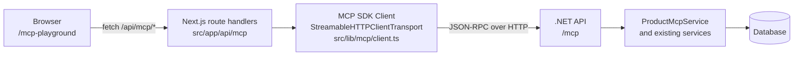

# MCP Playground

`/mcp-playground` is a small **manual MCP client** built into the Next.js frontend. It connects to the .NET API's MCP endpoint (Streamable HTTP), lists the server's tools, resources and prompts, and lets a human call them. No AI model is involved: you are the brain.

> **Local demo only.** No authentication, no authorization, one new MCP connection per request. Do not deploy it.

## Architecture



- The browser never calls `/mcp` directly. All MCP traffic goes through server-side route handlers, so CORS is not needed and the MCP URL stays server-side.
- The client does **not** declare the elicitation capability, so the server uses its non-interactive `confirmed`-parameter fallback when a tool supports it.

| Route | Method | Purpose |
| --- | --- | --- |
| `/api/mcp/info` | GET | Server name/version, capabilities, connection status |
| `/api/mcp/tools` | GET | Tools with input schema and annotations |
| `/api/mcp/tools/call` | POST `{ name, arguments }` | Call a tool |
| `/api/mcp/resources` | GET | Resources and resource templates |
| `/api/mcp/resources/read` | POST `{ uri }` | Read a resource |
| `/api/mcp/prompts` | GET | Prompts with arguments |
| `/api/mcp/prompts/get` | POST `{ name, arguments }` | Get a prompt |

Errors are normalized to `{ ok: false, message }`. The server's own message is preserved. HTTP status codes: 400 bad input, 422 tool returned `isError`, 502 MCP/JSON-RPC error, and 503 server unreachable.

## Configuration

| Variable | Default | Used by |
| --- | --- | --- |
| `MCP_URL` | `http://localhost:5105/mcp` | Server-side route handlers only |

Copy `.env.example` to `.env.local` (or add `MCP_URL` to `.env`) to override. The page shows only the host part of the URL.

## Running

1. Start the .NET API (from `product-inventory-backend/ProductInventoryTrackerAPI`):
   ```bash
   dotnet run
   ```
   Confirm that it listens on `http://localhost:5105`.
2. Start the frontend (from this folder):
   ```bash
   npm install
   npm run dev
   ```
3. Open http://localhost:3000/mcp-playground.

## Demo script

1. **List:** Open the page. The badge shows *Connected*, and the Tools tab lists `search_products`, `get_product`, `get_inventory_summary` (*read-only*), `create_product`, and `update_product` (*writes data*).
2. **Read summary:** In the Resources tab, click **Read** on `app://products/summary`. The Result panel shows JSON and the duration.
3. **Search:** In Tools, open `search_products`, tick `lowStockOnly`, and click **Call**.
4. **Dry-run update:** Open `update_product`, then use **Load product** to pick a product. The form pre-fills; change for example `reorderThreshold`. Changed fields are highlighted, and the collapsed *Request JSON* shows that only changed fields are sent.
   - If the server tool has `dryRun`/`confirmed` params, the button reads **Preview (dry run)** and shows the server's before and after diff.
   - Otherwise the button reads **Review and save** and shows a local before and after summary.
5. **Confirm:** Click **Confirm and save**, or **Save changes** in the dialog. The form reloads the product with fresh values.
6. **Audit log:** Open the Audit Log tab and enable auto-refresh. It reads `app://audit/recent`.
7. **Existing UI:** Open `/products` and refresh. The change is visible.
8. **Prompts:** In Prompts, fill `weekStartDate` for `weekly_inventory_review` and click **Get Prompt**. The prompt only returns text; nothing is executed.

## Safe write workflow

- **Tools with `dryRun` and `confirmed` params:** clicking **Preview (dry run)** sends `dryRun: true`. The UI then renders the returned changes as a field/old/new table. **Confirm and save** re-sends the call with `dryRun: false, confirmed: true`.
- **Write tools without those params:** the UI shows a client-side confirmation dialog before sending.
- **`expectedLastModifiedAt`:** if a tool has this param, it is pre-filled from `get_product`'s `lastModifiedAt`. Concurrency conflict messages are shown as-is.
- **`idempotencyKey`:** if a tool has this param, a key is generated with `crypto.randomUUID()` for each form session. It is regenerated after a successful save.
- **"Not saved..." responses:** a server reply that starts with "Not saved..." is shown as an informational notice, not an error.

## Limitations

- No AI model and no Agent Skill. A human picks tools and arguments.
- No authentication; local use only.
- Elicitation is intentionally not supported; the `confirmed`-parameter fallback is used instead.
- A new MCP connection is opened per request (simple, not efficient).
- The Audit Log tab needs an `app://audit/recent` resource on the server. It shows a notice if the resource is missing.
- The page is not linked from the sidebar, because existing components were left unchanged. Navigate to `/mcp-playground` directly.
